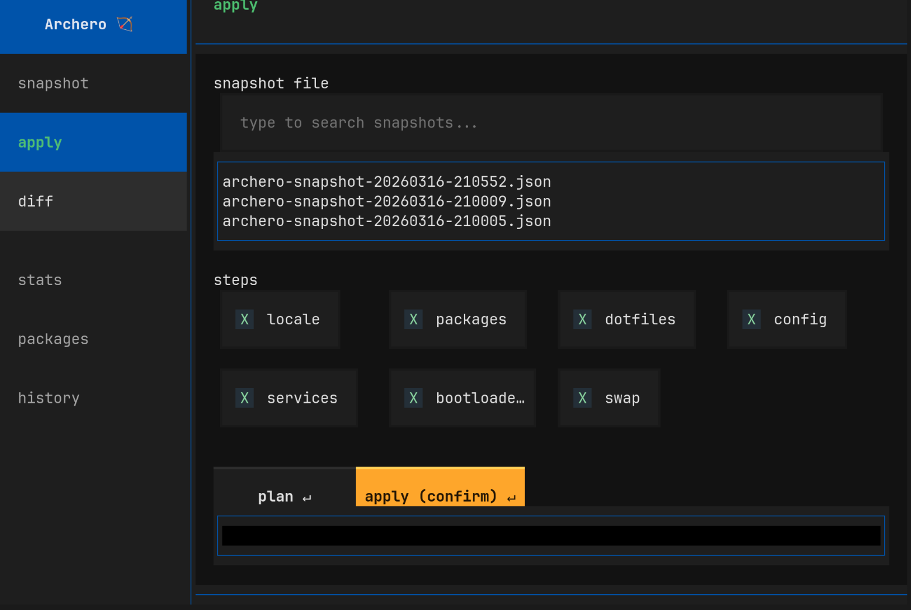
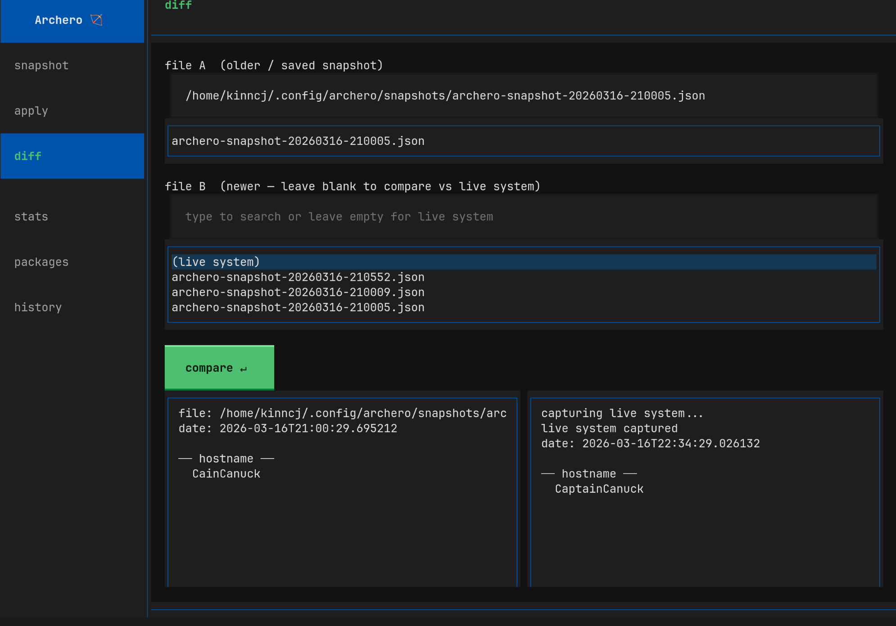

# Archero

> System snapshot, plan, apply, and diff tool for CachyOS and Arch Linux.

**Author:** Kinn Coelho Juliao \<kinncj@protonmail.com\>
**License:** [GPLv3](https://www.gnu.org/licenses/gpl-3.0.html)



---

## What it does

Archero snapshots your entire Arch Linux system state into a single JSON file — hardware, kernel, packages, dotfiles, services, config, GPU, power, and more. Then it lets you **plan** changes (terraform-style), **apply** them to a fresh install, or **diff** two snapshots to see what changed.

Single file. No build step. No dependencies beyond `textual`.

| Mode | What it does |
|---|---|
| **TUI** | Full interactive interface (default, no args) |
| **snapshot** | Dump current system state to JSON |
| **apply** | Plan or apply from a snapshot |
| **diff** | Compare two snapshots, or a snapshot vs live system |

---

## Quick start

```bash
git clone https://github.com/kinncj/archero
cd archero
chmod +x main.py
./main.py
```

If `textual` isn't installed, Archero installs it automatically — trying `pacman`, then `paru`/`yay`, then `pip`.

### Requirements

- Python 3.10+
- `textual` (auto-installed)

---

## TUI

Launch with no arguments:

```bash
./main.py
```

### Navigation

| Key | Action |
|---|---|
| `1`-`6` | Jump directly to a panel |
| `Enter` | Open selected panel |
| `Esc Esc` | Return to sidebar |
| `Tab` / arrows | Move between fields |
| `Ctrl+Q` | Quit |

### Panels

| # | Panel | Description |
|---|---|---|
| 1 | **snapshot** | Select sections, set output path, capture |
| 2 | **apply** | Load a snapshot, plan changes or apply |
| 3 | **diff** | Compare two snapshots or snapshot vs live system |
| 4 | **stats** | Live power draw, battery, GPU temp, RAM (auto-refresh) |
| 5 | **packages** | Full package list with AUR tags and search |
| 6 | **history** | Browse saved snapshots with metadata preview |

---

## CLI

### snapshot

```bash
# Capture everything (some sections need root)
sudo ./main.py snapshot

# Pretty-print, custom output
sudo ./main.py snapshot --pretty --output ~/my-snapshot.json

# Specific sections only
./main.py snapshot --sections packages dotfiles services

# Control note modules
./main.py snapshot --note-modules amdgpu hibernate
./main.py snapshot --disable-note-modules nvidia
```

Sections: `meta` `hardware` `kernel` `boot` `filesystem` `packages` `dotfiles` `services` `config` `power` `gpu` `development` `security` `notes`

### apply (plan + apply)

**Plan mode** (default, no root needed) — shows what would change, like `terraform plan`:

```bash
./main.py apply my-snapshot.json
```

```
════════════════════════════════════════════════════════════
  PLAN — comparing snapshot vs live system
════════════════════════════════════════════════════════════
  + create/install   ~ modify   - remove   = unchanged
────────────────────────────────────────────────────────────

── Locale & Timezone ──
  ~ hostname: CaptainCanuck -> CainCanuck
  = timezone: America/Toronto

── Packages ──
  + install 3 AUR packages:
    + some-pkg
  = all native packages match

── Bootloader (grub) ──
  ~ /etc/default/grub (modified -> will regenerate grub.cfg)
  = /etc/mkinitcpio.conf

════════════════════════════════════════════════════════════
  Plan: 5 change(s). Run with --confirm to apply.
════════════════════════════════════════════════════════════
```

**Apply mode** (needs root):

```bash
sudo ./main.py apply my-snapshot.json --confirm

# Apply specific steps only
sudo ./main.py apply my-snapshot.json --confirm --steps packages dotfiles config
```

Steps: `locale` `packages` `dotfiles` `config` `services` `bootloader` `swap`

Apply always backs up files before overwriting (`.bak-TIMESTAMP`).

### diff

```bash
# Snapshot vs live system
./main.py diff my-snapshot.json

# Two snapshots
./main.py diff old.json new.json
```

Compares: hostname, packages (native/AUR/flatpak), kernel version + modules, services, config (modprobe.d, udev), power profile, dev tools, dotfile directories.



---

## Note modules

Archero auto-detects hardware and system features, reporting status, known quirks, and recommendations:

| Module | Detects via | Reports |
|---|---|---|
| `amdgpu` | `/sys/module/amdgpu` | PSR, runtime PM, gpu_recovery, dc param |
| `nvidia` | `/sys/module/nvidia` | Driver version, power mgmt, wayland compat |
| `intel_gpu` | `/sys/module/i915` | GuC/HuC, PSR, flickering |
| `hibernate` | swap + resume cmdline | Swap config, wakeup source conflicts |
| `bootloader` | grub/systemd-boot/limine | Snapshot support, btrfs integration |
| `desktop` | `$XDG_CURRENT_DESKTOP` | Session type, portal packages |
| `power` | battery presence | Wifi power save, NVMe PM |
| `kernel_modules` | `/etc/modprobe.d/` | Blacklisted modules |

Modules return `null` when not applicable (e.g., `nvidia` on AMD-only systems).

### Config override

Create `~/.config/archero/config.json`:

```json
{
  "note_modules": {
    "disabled": ["nvidia"],
    "enabled": ["amdgpu", "hibernate"]
  }
}
```

User notes from `~/.config/archero/notes.json` are merged under the `"user"` key.

---

## Snapshot format

Plain JSON, one top-level key per section:

```json
{
  "meta":        { "hostname": "...", "distro": "cachyos", "schema_version": "1.0.0" },
  "hardware":    { "cpu_model": "...", "ram_total": "...", "storage": [] },
  "kernel":      { "version": "...", "cmdline": "...", "loaded_modules": [] },
  "boot":        { "bootloader": "grub", "bootloader_config": {}, "mkinitcpio": {} },
  "filesystem":  { "fstab": [], "btrfs_subvolumes": [], "swap": [] },
  "packages":    { "native_explicit": [], "aur_packages": [], "flatpak": [] },
  "dotfiles":    { "key_dotfiles": {}, "git_repos": [] },
  "services":    { "enabled_system_units": [], "custom_system_units": {} },
  "config":      { "modprobe_d": {}, "udev_rules": {}, "sysctl_d": {} },
  "power":       { "power_profile": "...", "hibernate": {} },
  "gpu":         { "gpu_devices": [], "psr": {}, "runtime_pm": {} },
  "development": { "tools": {}, "ollama_models": [], "shell": "fish" },
  "security":    { "secure_boot": "...", "firewall": {} },
  "notes":       { "amdgpu": { "detected": true, "status": {}, "quirks": [], "recommendations": [] } }
}
```

Snapshots are stored in `~/.config/archero/snapshots/` by default.

---

## Architecture

```
main.py (single file)
+-- Primitives          run(), read(), sysfs(), backup()
+-- Collectors          collect_*() -> dict, registered in ALL_COLLECTORS
+-- Note Modules        _notes_*() -> dict|None, registered in NOTE_MODULES
+-- Applier             plan() + apply(), step_* methods
+-- diff_snapshots()    CLI diff engine
+-- TUI (textual)
|   +-- SnapshotPanel   section checkboxes, capture
|   +-- ApplyPanel      plan / apply with step selection
|   +-- DiffPanel       side-by-side comparison
|   +-- StatsPanel      live sysfs polling
|   +-- PackagesPanel   search + browse
|   +-- HistoryPanel    snapshot file browser
+-- main()              CLI dispatch + TUI launcher
```

Everything is read-only unless `apply --confirm` is passed. Apply always creates `.bak` files before overwriting.

---

## Contributing

PRs welcome.

- Single-file is a hard requirement — don't split into a package
- No runtime dependencies beyond `textual`
- Collectors must never raise — catch exceptions and return `{"error": str(e)}`
- All apply actions go through `self.do()` — never write directly

---

## License

GNU General Public License v3.0 — see [LICENSE](LICENSE).
